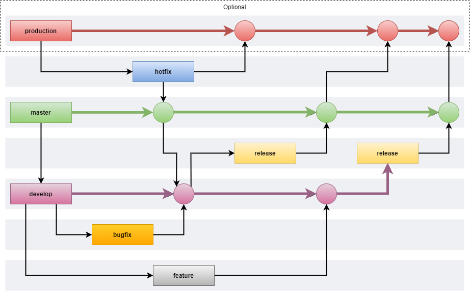

# SemVer Convention

## Branches

### With Additional Production Branch

| Branch     | From Branch    | To Branch              | Details                                 |
|------------|----------------|------------------------|-----------------------------------------|
| production | master         | hot fix                | Optional for CD (if multiple customers) |
| hotfix     | production     | production/master      | Hotfix for production   `With production branch` |
| hotfix     | master         | master/develop         | Hotfix for master   `Without production branch` |
| master     | hotfix/release | production/develop     | Core branch                             |
| release    | develop        | master                 | Release                                 |
| develop    | master         | feature/bugfix/release | Development (promotion to release)      |
| feature    | develop        | develop                | New feature                             |
| bugfix     | develop        | develop                | Bug fix                                 |

### Details 

Production, master branch:
 - with production branch for multiple for multiple clients
 - without production, master branch as production
 
## Commits

| Prefix       | Message                                      |
|--------------|----------------------------------------------|
| feat         | feat: add Kerberos auth to database          |
| fix          | fix: problem auth via Kerberos               |
| style        | style: Kerberos method spacing               |
| docs         | docs: added Kerberos auth documentation      |
| build/vendor | build: updated Kerberos dependency           |
| perf         | perf: increase auth via Kerberos performance |
| test         | test: add test for Kerberos auth             |
| refactor     | refactor: renamed varaibles in Kerberos auth |
| chore        | chore: add Kerberos dependency               |
